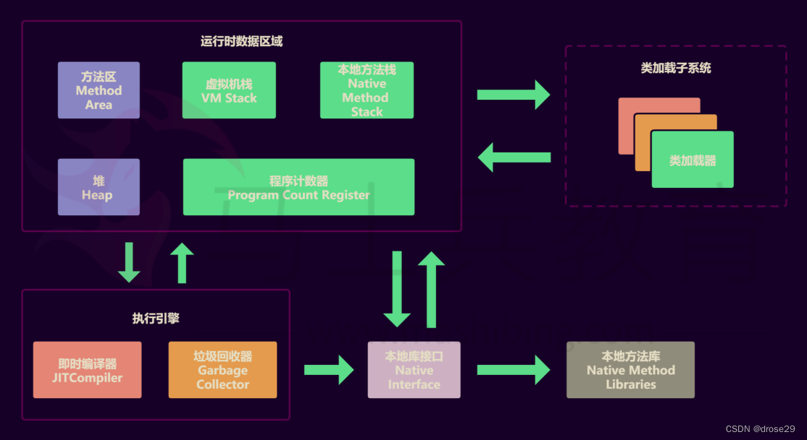

<!-- START doctoc generated TOC please keep comment here to allow auto update -->
<!-- DON'T EDIT THIS SECTION, INSTEAD RE-RUN doctoc TO UPDATE -->
**Table of Contents**  *generated with [DocToc](https://github.com/thlorenz/doctoc)*

- [安卓面试总结](#%E5%AE%89%E5%8D%93%E9%9D%A2%E8%AF%95%E6%80%BB%E7%BB%93)
  - [Java](#java)
    - [集合](#%E9%9B%86%E5%90%88)
      - [ArrayList](#arraylist)
      - [LikedList](#likedlist)
      - [HashMap](#hashmap)
      - [CopyOnWriteArrayList（ArrarList的线程安全）](#copyonwritearraylistarrarlist%E7%9A%84%E7%BA%BF%E7%A8%8B%E5%AE%89%E5%85%A8)
      - [ConcurrentHashMap（HashMap的线程安全）](#concurrenthashmaphashmap%E7%9A%84%E7%BA%BF%E7%A8%8B%E5%AE%89%E5%85%A8)
    - [线程](#%E7%BA%BF%E7%A8%8B)
      - [线程同步](#%E7%BA%BF%E7%A8%8B%E5%90%8C%E6%AD%A5)
      - [线程通信](#%E7%BA%BF%E7%A8%8B%E9%80%9A%E4%BF%A1)
      - [其他](#%E5%85%B6%E4%BB%96)
        - [线程池](#%E7%BA%BF%E7%A8%8B%E6%B1%A0)
        - [ThreadLocal](#threadlocal)
    - [JVM](#jvm)
      - [类加载机制](#%E7%B1%BB%E5%8A%A0%E8%BD%BD%E6%9C%BA%E5%88%B6)
      - [主要组成部分和作用](#%E4%B8%BB%E8%A6%81%E7%BB%84%E6%88%90%E9%83%A8%E5%88%86%E5%92%8C%E4%BD%9C%E7%94%A8)
        - [内存模型](#%E5%86%85%E5%AD%98%E6%A8%A1%E5%9E%8B)
      - [垃圾回收机制（算法）](#%E5%9E%83%E5%9C%BE%E5%9B%9E%E6%94%B6%E6%9C%BA%E5%88%B6%E7%AE%97%E6%B3%95)
    - [网络相关](#%E7%BD%91%E7%BB%9C%E7%9B%B8%E5%85%B3)
      - [UDP/TCP](#udptcp)
        - [UDP](#udp)
        - [TCP](#tcp)
      - [Http/Https](#httphttps)
      - [WebSocket](#websocket)
    - [设计模式](#%E8%AE%BE%E8%AE%A1%E6%A8%A1%E5%BC%8F)
      - [单例模式](#%E5%8D%95%E4%BE%8B%E6%A8%A1%E5%BC%8F)
      - [建造者模式](#%E5%BB%BA%E9%80%A0%E8%80%85%E6%A8%A1%E5%BC%8F)
      - [观察者模式](#%E8%A7%82%E5%AF%9F%E8%80%85%E6%A8%A1%E5%BC%8F)
      - [原型模式](#%E5%8E%9F%E5%9E%8B%E6%A8%A1%E5%BC%8F)
      - [责任链模式](#%E8%B4%A3%E4%BB%BB%E9%93%BE%E6%A8%A1%E5%BC%8F)
      - [代理模式](#%E4%BB%A3%E7%90%86%E6%A8%A1%E5%BC%8F)
        - [静态代理](#%E9%9D%99%E6%80%81%E4%BB%A3%E7%90%86)
        - [动态代理](#%E5%8A%A8%E6%80%81%E4%BB%A3%E7%90%86)
      - [工厂模式](#%E5%B7%A5%E5%8E%82%E6%A8%A1%E5%BC%8F)
        - [简单工厂](#%E7%AE%80%E5%8D%95%E5%B7%A5%E5%8E%82)
        - [工厂方法](#%E5%B7%A5%E5%8E%82%E6%96%B9%E6%B3%95)
        - [抽象工厂](#%E6%8A%BD%E8%B1%A1%E5%B7%A5%E5%8E%82)
  - [Kotlin](#kotlin)
    - [run、apply、let、also、with的用法和区别](#runapplyletalsowith%E7%9A%84%E7%94%A8%E6%B3%95%E5%92%8C%E5%8C%BA%E5%88%AB)
      - [let](#let)
      - [also](#also)
      - [with](#with)
      - [run](#run)
      - [apply](#apply)
    - [其他](#%E5%85%B6%E4%BB%96-1)
    - [协程](#%E5%8D%8F%E7%A8%8B)
  - [Android](#android)
    - [四大组件](#%E5%9B%9B%E5%A4%A7%E7%BB%84%E4%BB%B6)
      - [Activity](#activity)
        - [Fragment](#fragment)
      - [Service](#service)
      - [BroadcastReceiver](#broadcastreceiver)
    - [View](#view)
      - [RecyleView](#recyleview)
      - [自定义View](#%E8%87%AA%E5%AE%9A%E4%B9%89view)
      - [滑动冲突](#%E6%BB%91%E5%8A%A8%E5%86%B2%E7%AA%81)
      - [事件分发机制](#%E4%BA%8B%E4%BB%B6%E5%88%86%E5%8F%91%E6%9C%BA%E5%88%B6)
    - [开源库](#%E5%BC%80%E6%BA%90%E5%BA%93)
      - [Okhttp](#okhttp)
      - [Refroit](#refroit)
      - [Glide](#glide)
      - [ViewModel](#viewmodel)
      - [LiveData](#livedata)
    - [Handler](#handler)
    - [优化](#%E4%BC%98%E5%8C%96)
      - [启动优化](#%E5%90%AF%E5%8A%A8%E4%BC%98%E5%8C%96)
      - [绘制优化（布局）](#%E7%BB%98%E5%88%B6%E4%BC%98%E5%8C%96%E5%B8%83%E5%B1%80)
      - [网络优化](#%E7%BD%91%E7%BB%9C%E4%BC%98%E5%8C%96)
      - [存储优化](#%E5%AD%98%E5%82%A8%E4%BC%98%E5%8C%96)
      - [自定义View优化](#%E8%87%AA%E5%AE%9A%E4%B9%89view%E4%BC%98%E5%8C%96)
      - [Apk体积优化](#apk%E4%BD%93%E7%A7%AF%E4%BC%98%E5%8C%96)
      - [WebView优化](#webview%E4%BC%98%E5%8C%96)
    - [通信](#%E9%80%9A%E4%BF%A1)
      - [蓝牙](#%E8%93%9D%E7%89%99)
        - [经典蓝牙](#%E7%BB%8F%E5%85%B8%E8%93%9D%E7%89%99)
        - [低功耗蓝牙](#%E4%BD%8E%E5%8A%9F%E8%80%97%E8%93%9D%E7%89%99)
      - [串口](#%E4%B8%B2%E5%8F%A3)
      - [USB](#usb)
    - [系统服务](#%E7%B3%BB%E7%BB%9F%E6%9C%8D%E5%8A%A1)
      - [AMS](#ams)
      - [WMS](#wms)
      - [PMS](#pms)
    - [跨进程通信](#%E8%B7%A8%E8%BF%9B%E7%A8%8B%E9%80%9A%E4%BF%A1)
      - [Bundle](#bundle)
      - [文件共享](#%E6%96%87%E4%BB%B6%E5%85%B1%E4%BA%AB)
      - [AIDL（基于Binder）](#aidl%E5%9F%BA%E4%BA%8Ebinder)
      - [Messager（基于Binder）](#messager%E5%9F%BA%E4%BA%8Ebinder)
      - [ContentProvider（基于Binder）](#contentprovider%E5%9F%BA%E4%BA%8Ebinder)
      - [Socket](#socket)
    - [其他](#%E5%85%B6%E4%BB%96-2)
  - [Gradle](#gradle)
  - [Dart](#dart)
  - [Flutter](#flutter)

<!-- END doctoc generated TOC please keep comment here to allow auto update -->

# 安卓面试总结
## Java

### 集合

#### ArrayList

- 基于数组实现的

- 查询用下标访问的速度比较快，但是插入和删除元素，会有移动元素的开销

- [扩容机制](https://juejin.cn/post/7092645723623129118)：ArrayList扩容的关键方法grow(): 获取到ArrayList中elementData数组的内存空间长度 扩容至原来的1.5倍

#### LikedList

- 基于双向链表实现的

- 插入和删除速度比较快，但是查询元素需要遍历元素

- 由于他的底层是用双向链表实现的，没有初始化大小，所以没有油扩容机制，就是一直在前面或者是后面新增就好

#### HashMap

- [深入剖析HashMap的底层原理](https://juejin.cn/post/7188057359754166331)

- HashMap的数据结构？

  基于数组+链表（jdk1.7），数组+链表+红黑树（jdk1.8），链表长度大于8时转换为红黑树。（JDK 1.7 之前使用头插法、JDK 1.8 使用尾插法）（注意：当碰撞导致链表大于 TREEIFY_THRESHOLD = 8 时，就把链表转换成红黑树）

- HashMap 的工作原理？

  HashMap 底层是 hash 数组和单向链表实现，数组中的每个元素都是链表，由 Node 内部类实现，HashMap 通过 put & get 方法存储和获取。

  - put方法

    1. 调用 hash(K) 方法计算 K 的 hash 值，然后结合数组长度，计算得数组下标；

    2. 调整数组大小（当容器中的元素个数大于 capacity * loadfactor 时，容器会进行扩容resize 为 2n）

    3. 如果 K 的 hash 值在 HashMap 中不存在，则执行插入，若存在，则发生碰撞；

       如果 K 的 hash 值在 HashMap 中存在，且它们两者 equals 返回 true，则更新键值对；

       如果 K 的 hash 值在 HashMap 中存在，且它们两者 equals 返回 false，则插入链表的尾部（尾插法）或者红黑树中（树的添加方式）。

  - get方法

    1. 调用 hash(K) 方法（计算 K 的 hash 值）从而获取该键值所在链表的数组下标；
    2. 顺序遍历链表，equals()方法查找相同 Node 链表中 K 值对应的 V 值。

- 当两个对象的 hashCode 相同会发生什么？

  因为 hashCode 相同，不一定就是相等的（equals方法比较），所以两个对象所在数组的下标相同，"碰撞"就此发生。又因为 HashMap 使用链表存储对象，这个 Node 会存储到链表中。这就是用对象作为key的时候为什么要重写 hashcode 和 equals的原因。 

- 你知道 hash 的实现吗？为什么要这样实现？

  JDK 1.8 中，是通过 hashCode() 的高 16 位异或低 16 位实现的：(h = k.hashCode()) ^ (h >>> 16)，主要是从速度，功效和质量来考虑的，减少系统的开销，也不会造成因为高位没有参与下标的计算，从而引起的碰撞。[hash算法总结](https://blog.csdn.net/a314774167/article/details/100110216)

- HashMap 的 table 的容量如何确定？loadFactor 是什么？该容量如何变化？这种变化会带来什么问题？

  1. table 数组大小是由 capacity 这个参数确定的，默认是16，也可以构造时传入，最大限制是1<<30；

  2. loadFactor 是装载因子，主要目的是用来确认table 数组是否需要动态扩展，默认值是0.75，比如table 数组大小为 16，装载因子为 0.75 时，threshold 就是12，当 table 的实际大小超过 12 时，table就需要动态扩容；

  3. 扩容时，调用 resize() 方法，将 table 长度变为原来的两倍（注意是 table 长度，而不是 threshold）

  4. 如果数据很大的情况下，扩展时将会带来性能的损失，在性能要求很高的地方，这种损失很可能很致命。

- 拉链法导致的链表过深问题为什么不用二叉查找树代替，而选择红黑树？为什么不一直使用红黑树？

  之所以选择红黑树是为了解决二叉查找树的缺陷，二叉查找树在特殊情况下会变成一条线性结构（这就跟原来使用链表结构一样了，造成很深的问题），遍历查找会非常慢。推荐：[面试问红黑树，我脸都绿了](https://mp.weixin.qq.com/s?__biz=MzI3ODcxMzQzMw==&mid=2247491467&idx=2&sn=1eb11dbfb7b72fdcf0360e06448c4cfc&chksm=eb539abddc2413aba4a97361951b87b91e618a820b49ea543c08e4e2713c541b83bb11b1c782&scene=21#wechat_redirect)。

  而红黑树在插入新数据后可能需要通过左旋，右旋、变色这些操作来保持平衡，引入红黑树就是为了查找数据快，解决链表查询深度的问题，我们知道红黑树属于平衡二叉树，但是为了保持“平衡”是需要付出代价的，但是该代价所损耗的资源要比遍历线性链表要少，所以当长度大于8的时候，会使用红黑树，如果链表长度很短的话，根本不需要引入红黑树，引入反而会慢。

#### CopyOnWriteArrayList（ArrarList的线程安全）

#### ConcurrentHashMap（HashMap的线程安全）

+ 说一说ConcurrentHashMap的锁机制原理

  - JDK 1.7 中，采用分段锁的机制，实现并发的更新操作，底层采用数组+链表的存储结构，包括两个核心静态内部类 Segment 和 HashEntry。Segment数组的意义就是将一个大的table分割成多个小的table来进行加锁，也就是上面的提到的锁分离技术，而每一个Segment元素存储的是HashEntry数组+链表，这个和HashMap的数据存储结构一样。
    1. Segment 继承 ReentrantLock（重入锁） 用来充当锁的角色，每个 Segment 对象守护每个散列映射表的若干个桶；
    2. HashEntry 用来封装映射表的键-值对；
    3. 每个桶是由若干个 HashEntry 对象链接起来的链表
  - JDK1.8中，采用Node + CAS + Synchronized来保证并发安全。取消类 Segment，直接用 table 数组存储键值对；当 HashEntry 对象组成的链表长度超过 TREEIFY_THRESHOLD 时，链表转换为红黑树，提升性能。底层变更为数组 + 链表 + 红黑树。

+ ConcurrentHashMap 在 JDK 1.8 中，为什么要使用内置锁 synchronized 来代替重入锁 ReentrantLock？

  1. 粒度降低了；

  2. JVM 开发团队没有放弃 synchronized，而且基于 JVM 的 synchronized 优化空间更大，更加自然。
  3. 在大量的数据操作下，对于 JVM 的内存压力，基于 API 的 ReentrantLock 会开销更多的内存。

+ ConcurrentHashMap的工作原理

  - JDK1.7的put方法

    对于ConcurrentHashMap的数据插入，这里要进行两次Hash去定位数据的存储位置。
    Segment实现了ReentrantLock,也就带有锁的功能，当执行put操作时，会进行第一次key的hash来定位Segment的位置，如果该Segment还没有初始化，即通过CAS操作进行赋值，然后进行第二次hash操作，找到相应的HashEntry的位置。

  - JDK1.7的get方法

    ConcurrentHashMap的get操作跟HashMap类似，只是ConcurrentHashMap第一次需要经过一次hash定位到Segment的位置，然后再hash定位到指定的HashEntry，遍历该HashEntry下的链表进行对比，成功就返回，不成功就返回null

  - JDK1.8的put方法

    1. 如果没有初始化就先调用initTable()方法对其初始化；
    2. 对key进行hash计算，求得值没有哈希冲突的话，则利用自旋CAS操作来进行插入数据；
    3. 如果存在hash冲突，那么就加synchronized锁来保证线程安全
    4. 如果存在扩容，那么就去协助扩容
    5. 加完数据之后，再判断是否还需要扩容

  - JDK1.8的get方法

    1. 据计算出来的 hashcode 寻址，如果就在桶上那么直接返回值。
    2. 如果正在扩容，且当前节点已经扩容完成，那么根据ForwardingNode查找扩容后的table上的对应数据
    3. 如果是红黑树那就按照树的方式获取值。如果不满足那就按照链表的方式遍历获取值。

### 线程

#### 线程同步

+ synchronized关键字

  + 锁的方式

    1. 类锁

       在同一个类中，不同对象的线程，执行同一方法时，保证多个线程串行执行此方法

       1. `synchronized`加在`static`方法上（静态方法锁）。
       2. `synchronized(*.class`)代码块。

    2. 对象锁

       在同一个类中，相同对象的线程，执行同一方法时，保证多个线程串行执行此方法

       1. `synchronized`加在`实例`方法上（实例方法锁）。
       2. `synchronized(对象`)代码块。

  + synchronized 和 volatile 关键字（区别和原理）

    1. volatile只能保证内存可见性，不能保证内存原子性，非阻塞

    2. synchronized既可以保证内存可见性，又能保证内存原子性，阻塞

    3. 如果写入变量值不依赖变量当前值，那么就可以用 volatile

    4. [volatile和synchronized的区别，图文并茂](https://zhuanlan.zhihu.com/p/111229417)

    5. synchronized底层原理：Java虚拟机是通过进入和退出Monitor对象来实现代码块同步和方法同步的，代码块同步使用的是`monitorenter`和 `monitorexit` 指令实现的，而方法同步是通过`Access flags`后面的标识来确定该方法是否为同步方法

+ 使用重入锁实现线程同步（ReentrantLock）

  - Synchronized和ReentrantLock的相同点？
    1. ReentrantLock和synchronized都是独占锁,只允许线程互斥的访问临界资源
    2. ReentrantLock和synchronized都是可重入的。synchronized因此可以放在被递归执行的方法上,且不用担心线程最后能否正确释放锁；而ReentrantLock在重入时要却确保重复获取锁的次数必须和重复释放锁的次数一样，否则可能导致其他线程无法获得该锁。
  -  Synchronized和ReentrantLock的不同点？
    1. ReentrantLock是Java层面的实现，synchronized是JVM层面的实现
    2. ReentrantLock可以实现公平和非公平锁
    3. ReentantLock获取锁时，限时等待，配合重试机制更好的解决死锁
    4. ReentrantLock 可响应中断
    5. 使用synchronized结合Object上的wait和notify方法可以实现线程间的等待通知机制。ReentrantLock结合Condition接口同样可以实现这个功能。而且相比前者使用起来更清晰也更简单。

+ 使用原子变量实现线程同步(AtomicInteger(乐观锁))

+ 使用阻塞队列实现线程同步(BlockingQueue （常用）add(),offer(),put()

#### 线程通信

+ 使用**volatile**关键字

  volatile有一个关键的特性：保证内存可见性，即多个线程访问内存中的同一个被volatile关键字修饰的变量时，当某一个线程修改完该变量后，需要先将这个最新修改的值写回到主内存，从而保证下一个读取该变量的线程取得的就是主内存中该数据的最新值，这样就保证线程之间的透明性，便于线程通信。

  ```java
  public class TestVolatile {
      private static volatile boolean flag=true;
      public static void main(String[] args){
          new Thread(new Runnable() {
              public void run() {
                  while (true){
                      if(flag){
                          System.out.println("线程A");
                          flag=false;
                      }
                  }
              }
          }).start();
  ​
  ​
          new Thread(new Runnable() {
              public void run() {
                  while (true){
                      if(!flag){
                          System.out.println("线程B");
                          flag=true;
                      }
                  }
              }
          }).start();
      }
  }
  ```

+ 使用notify和wait的实现

  ```java
  //生产者消费者模型
  
  //生产者
  public class Producer implements Runnable{
  
      private Queue<Integer> queue;
      private int maxSize;
  
      public Producer(Queue<Integer> queue, int maxSize){
          this.queue = queue;
          this.maxSize = maxSize;
      }
  
      @Override
      public void run() {
          while (true){
              synchronized (queue){
                  while (queue.size() == maxSize){
                      try{
                          System.out.println("Queue is Full");
                          queue.wait();
                      }catch (InterruptedException ie){
                          ie.printStackTrace();
                      }
                  }
                  Random random = new Random();
                  int i = random.nextInt();
                  System.out.println("Produce " + i);
                  queue.add(i);
                  queue.notifyAll();
              }
          }
      }
  }
  
  //消费者
  public class Consumer implements Runnable{
  
      private Queue<Integer> queue;
      private int maxSize;
  
      public Consumer(Queue<Integer> queue, int maxSize){
          this.queue = queue;
          this.maxSize = maxSize;
      }
  
      @Override
      public void run() {
          while (true){
              synchronized (queue){
                  while (queue.isEmpty()){
                      System.out.println("Queue is Empty");
                      try{
                          queue.wait();
                      }catch (InterruptedException ie){
                          ie.printStackTrace();
                      }
                  }
                  int v = queue.remove();
                  System.out.println("Consume " + v);
                  queue.notifyAll();
              }
          }
      }
  }
  
  //Main
  public class Main {
      public static void main(String[] args){
          Queue<Integer> queue = new LinkedList<>();
          int maxSize = 10;
          Producer p = new Producer(queue, maxSize);
          Consumer c = new Consumer(queue, maxSize);
          Thread pT = new Thread(p);
          Thread pC = new Thread(c);
          pT.start();
          pC.start();
      }
  }
  ```

+ 可重入锁ReentrantLock的实现

+ 阻塞队列BlockingQueue的实现

+ 信号量Semaphore的实现

#### 其他

##### 线程池

+ 线程池的种类
  1. newCachedThreadPool 创建一个可缓存的线程池，如果线程池长度超过处理需要，可灵活回收空闲线程，若无可回收，则新建线程
  2. newFixedThreadPool 创建一个定长线程池，可控制最大并发数，超出的线程将在队列中等待。
  3. newScheduledThreadPool 创建一个定时线程池，支持定时及周期性的执行任务。
  4. newSingleThreadExecutor 创建一个单线程化的线程池，它只会用唯一的工作线程来执行任务，保证所有的任务按照指定顺序执行(FIFO,LIFO)。
+ 重要参数
  1. corePoolSize就是线程池中的核心线程数量，这几个核心线程，只是在没有用的时候，也不会被回收。
  2. maximumPoolSize就是线程池中可以容纳的最大线程的数量。
  3. keepAliveTime，就是线程池中除了核心线程之外的其他的最长可以保留的时间，因为在线程池中，除了核心线程即使在无任务的情况下也不能被清除，其余的都是有存活时间的，意思就是非核心线程可以保留的最长的空闲时间，util，就是计算这个时间的一个单位。
  4. workQueue，就是等待队列，任务可以储存在任务队列中等待被执行，执行的是FIFIO原则(先进先出)。
  5. threadFactory，就是创建线程的线程工厂。
  6. handler，是一种拒绝策略，我们可以在任务满了之后，拒绝执行某些任务。

##### ThreadLocal

如果使用ThreadLocal管理变量，则每一个使用该变量的线程都获得该变量的副本，副本之间相互独立，这样每一个线程都可以随意修改自己的变量副本，而不会对其他线程产生影响。变量局部化。

### JVM

#### 类加载机制

- 类加载阶段

  1. 加载

     加载是类加载过程中的一个阶段，这个阶段会在内存中生成一个代表这个类的java.lang.Class对象，作为方法区这个类的各种数据的入口。

  2. 验证 

     确保Class文件的字节流中包含的信息是否符合当前虚拟机的要求，并且不会危害虚拟机自身的安全。

  3.  准备 

     准备阶段是正式为类变量分配内存并设置类变量的初始值阶段，即在方法区中分配这些变量所使用的内存空间。

  4.  解析

     解析阶段是指虚拟机将常量池中的符号引用替换为直接引用的过程。

  5.  初始化

     初始化阶段是执行类构造器<client>方法的过程。到了初始阶段，才开始真正执行类中定义的Java程序代码。

- 类加载器

  1. 启动类加载器

     负责加载Java_HOME/lib目录中的类库，或通过-Xbootclasspath参数指定路径中被虚拟机认可的类库。

  2. 扩展类加载器

     负责加载 Java_HMOE/lib/ext 目录中的类库，或者通过java.ext.dirs系统变量加载指定路径中的类库。

  3. 应用程序类加载器

     负责加载用户路径(classpath)上的类库。

  4. 自定义加载器

     也可以通过继承java.lang.ClassLoader实现自定义的类加载器

- 双亲委派模型

  1. 向上委派

     第一步： 将自定义加载器挂载到应用程序类加载器 

     第二步： 应用程序类加载器将请求委托给扩展类加载器 

     第三步： 扩展类加载器将请求委托给启动类加载器

  2. 向下委托

     第一步： 启动类在加载路径下查找并加载Class文件，如果没有找到就交给扩展类加载器加载 

     第二步：扩展类加载器在它的加载路径下查找并加载Class文件，如果还是没有找到，再交给应用程序类加载器加载 

     第三步：应用程序类加载器在加载路径下查找并加载Class文件，如果还是没有找到，就交给自定义加载器进行加载 

     第四步：自定义加载器在用户指定的位置进行查找并加载Class文件，如果还是没有找到，JVM抛出ClassNotFund异常。这时类加载失败，JVM也启动失败。

#### 主要组成部分和作用



+ Class Loader（类加载器）：根据给定的全限定名类名（如：java.lang.Object）来加载到运行时数据区（Running data area）的方法区中（Method Area）。
+ Execution engine（执行引擎）：执行classes中的指令
+ Native Interface(本地库接口)：与Native libraries交互，是其它编程语言交互的接口。
+ Running data area（运行时方法区）：这块就是我们常说的JVM内存

##### 内存模型

+ 程序计数器（Program Counter Register）：当前线程所执行的字节码的行号指示器，字节码解析器的工作是通过改变这个计数器的值，来选取下一条需要执行的 字节码指令，分支、循环、跳转、异常处理、线程恢复等基础功能，都需要依赖这个 计数器来完成；
+ Java 虚拟机栈（Java Virtual Machine Stacks）：虚拟机栈的内存空间是给线程使用的，每个线程启动后，虚拟机为其分配一块栈内存空间；每个线程分配的虚拟机栈内存区域由多个栈帧（Frame）组成，栈帧对应着每个方法调用时所占用的内存（线程运行时，其实就是执行我们编写的源代码编译后的字节码嘛、说到底就是一个个的方法调用）；每个栈帧的由局部变量表、操作数栈、动态链接、方法返回值地址等组成
+ 本地方法栈（Native Method Stack）：与虚拟机栈的作用是一样的，只不过虚 拟机栈是服务 Java方法的，而本地方法栈是为虚拟机调用 Native 方法服务的；
+ Java 堆（Java Heap）：Java 虚拟机中内存大的一块，是被所有线程共享 的，几乎所有的对象实例都在这里分配内存；
+ 方法区（Methed Area）：用于存储已被虚拟机加载的类信息、常量、静态变 量、即时编译后的代码等数据

#### 垃圾回收机制（算法）

- GC类型

  1. Minor GC：只回收新生代区域。
  2. Major GC：只回收老年代区域。只有CMS实现了Major GC，所以在老年代里，触发GC，除了CMS和G1之外的其他收集器，大多数触发的其实是 Full GC
  3. Full GC：回收整个堆区和方法区
  4. Mixed GC：回收整个新生代和部分老年代。G1收集器实现了这个类型

- 内存区域

  - 新生代（Young generation）

    |              |                                                              |
    | ------------ | ------------------------------------------------------------ |
    | 触发的gc类型 | Minor GC                                                     |
    | 空间划分     | Eden Space+From Space+To Space                               |
    | 空间分配     | 8：1：1                                                      |
    | GC收集顺序   | 1. 绝大多数新创建的对象会存放在伊甸园空间（Eden）。          |
    |              | 2. 在伊甸园空间执行第 **1** 次GC（Minor GC）之后，存活的对象被移动到其中一个幸存者空间（Survivor）。 |
    |              | 3. 此后每次 Minor GC，都会将 Eden 和 使用中的Survivor 区域中存活的对象，一次性复制到另一块空闲中的Survivor区，然后直接清理 Eden 和 使用过的那块Survivor 空间。 |
    |              | 4. 从以上空间分配我们知道，Survivor区内存占比很小，当空闲中的Survivor空间不够存放活下来的对象时，这些对象会通过分配担保机制直接进入老年代。 |
    |              | 5. 在以上步骤中重复N次（N = MaxTenuringThreshold（年龄阀值设定，默认15））依然存活的对象，就会被移动到老年代。 |
    | 主要点       | 1. **两个幸存者空间，必须有一个是保持空的**                  |
    |              | 2. **新创建的对象，是保存在伊甸园空间的（Eden）。那些经历多次GC依然存活的对象会经由幸存者空间（Survivor）转存到老年代空间（Old generation）**。 |

  - 老年代（Old generation）

    对象在新生代周期中存活了下来的，会被拷贝到这里。通常情况下这个区域分配的空间要比新生代多。正是由于对象经历的GC次数越多越难回收，加上相对大的空间，发生在老年代的GC次数要比新生代少得多。这个区域触发的垃圾回收称之为：**Major GC** 或者 **Full GC**

- 算法
  
  - 复制算法：（年轻代）
  
    1. 实现方法
  
       为了解决效率问题，一种称为“复制”(Copying)  的收集算法出现了，它将可用内存按容量划分为大小相等的两块，每次只使用其中的一块。当这一块的内存用完了，就将还存话着的对象复制到另外一块上面，然后再把已使用过的内存空间一次清理掉。这样使得每次都是对整个半区进行内存回收，内存分配时也就不用考虑内存碎片等复杂情况，只要移动堆顶指针，按顺序分配内存即可，实现简单，运行高效，算是用空间来换时间的思维
  
    2. 优点
  
       - 可以有效地处理大部分对象都是临时对象的情况，例如新生代中的对象。
       - 不会产生内存碎片，因为所有存活的对象都被复制到一个新的内存空间中。
  
    3. 缺点
  
       - 需要一半的内存空间用于复制存活的对象，会造成空间浪费。
       - 当有大量存活的对象时，复制效率会降低。
  
  - 标记清除算法（老年代）：先标记出要回收的对象，然后统一回收这些对象
  
    1. 实现方法
  
       首先标记出所有需要回收的对象（可达性分析）。在标记完成后统一回收所有被标记的对象。
  
    2. 优点
  
       - 实现简单，算法简单、容易实现，与保守式GC 算法兼容，有效处理不连续的内存空间
       - 不需要移动对象，因此不会浪费时间和空间。
  
    3. 缺点
  
       - 效率问题：标记和清除两个过程的效率都不高，且需要进行两次扫描，第一次标记垃圾对象，第二次清除垃圾对象。
  
       - 空间问题：标记清除之后会产生大量不连续的内存碎片，空间碎片太多可能会导致以后在程序运行过程中需要分配较大对象时，无法找到足够的连续内存而不得不提前触发另一次垃圾收集动作，从而导致频繁的内存分配和回收。
  
  - 标记整理算法（老年代）：先标记清除，再次扫描并往一端滑动存活对象。
  
    1. 实现方法
  
       - 标记阶段：从一组 GC Roots 开始，标记出所有存活的对象，并将这些存活对象的标记信息保存在对象头中。
  
       - 压缩阶段：将所有存活的对象移动到内存的一端，释放出所有空闲的内存空间。在移动对象时，需要更新所有引用对象的指针，确保它们指向对象移动后的位置。
  
       - 更新指针：由于移动对象的过程中，可能会修改引用对象的指针，因此需要扫描整个堆内存，将所有指向移动过的对象的指针进行更新。（这不算一个阶段）
  
    2. 优点
  
       - 可以有效地处理不连续的内存空间。
       - 不会产生内存碎片，因为所有存活的对象都被移动到一端。
  
    3. 缺点
  
       - 压缩阶段需要移动存活的对象，占用了系统的消耗，并且如果标记对象过多的话，损耗可能会很大，会浪费时间和空间。在标记对象相对较少的时候，效率较高。
       - 需要进行两次扫描，第一次标记存活对象，第二次移动存活对象。
  
- 如何判断一个对象是否死亡？

  1. 引用计数法：给每一个对象添加一个引用计数器，当一个引用指向对象，计数器值加一，当一个引用失效，计数器减一，判断计数器是否为0，确定对象是否可用。但是无法解决循环引用的问题。
  2. 可达性分析算法：以GC Roots作为起点，可以达到的就不可回收，不可达到的暂定认为”死亡“；但是不是非死不可，有通过finalize方法加重新连接引用链的方法，让一个对象重新复活；但是**不保证执行完成**，这种方法是不靠谱的，也是不建议使用的

- 内存泄漏和内存溢出

  1. 静态集合类引起内存泄漏
  2. 监听器
  3. 各种连接
  4. 内部类和外部模块的引用
  5. 单例模式

+ 强弱软虚引用的使用场景

  1. 强引用

     只要某个对象有强引用与之关联，JVM则无法回收该对象，即使在内存不足的情况下，JVM宁愿抛出OutOfMemory错误，也不会回收这种对象

  2. 软引用

     软引用常常用来描述一些有用但是非必需的对象。对于软引用关联的对象，会在JVM内存不足时既OutOfMemory之前将这些对象列入回收范围，进行二次回收。如果这时回收还是没有足够的内存才会造成内存溢出异常。软引用一般用于网页的缓存图片的缓存等等比较耗时的操作，但是这些操作目前一般使用LruChche来实现，因此目前代码中很少见到SoftReference。

  3. 弱引用

     弱引用也是用来描述非必要对象的，但是它的轻度比软引用要弱一些，被弱引用关联的对象只能生存到下一次垃圾收集器回收之前，当[JVM](https://so.csdn.net/so/search?q=JVM&spm=1001.2101.3001.7020)进行gc操作时，无论当前内存是否足够，都会回收掉只被弱引用关联的对象。

  4. 虚引用也称之为幽灵引用，或者幻影引用，它是最弱的一种引用关系，一个对象是否有虚引用的存在，完全不会对其生存时间构成影响。也无法通过虚引用来取得一个对象的实例，为一个对象设置为虚引用的唯一目的是希望这个对象被回收器回收时能收到一个系统通知

### 网络相关

#### UDP/TCP

##### UDP

是无连接的，尽最大可能交付，没有拥塞控制，面向报文（对于应用程序传下来的报文不合并也不拆分，只是添加 UDP 首部），支持一对一、一对多、多对一和多对多的交互通信。

##### TCP

是面向连接的，提供可靠交付，有流量控制，拥塞控制，提供全双工通信，面向字节流（把应用层传下来的报文看成字节流，把字节流组织成大小不等的数据块），每一条 TCP 连接只能是点对点的（一对一）

+ 什么是 TCP 的三次握手？

  1. 第一次握手：客户端发送网络包，服务端收到了。这样服务端就能得出结论：客户端的发送能力、服务端的接收能力是正常的
  2. 第二次握手：服务端发包，客户端收到了。这样客户端就能得出结论：服务端的接收、发送能力，客户端的接收、发送能力是正常的。
  3. 第三次握手：客户端发包，服务端收到了。这样服务端就能得出结论：客户端的接收、发送能力，服务端的发送、接收能力是正常的。第一、二次握手后，服务端并不知道客户端的接收能力以及自己的发送能力是否正常

+ 什么是TCP的四次挥手？

  1. 第一次挥手：首先客户端向服务器发送一段 TCP 报文表明其想要释放 TCP 连接
  2. 第二次挥手：服务器接收到客户端请求断开连接的 FIN 报文后，结束 ESTABLISHED 阶段，进入 CLOSE-WAIT 阶段并返回一段 TCP 报文
  3. 第三次挥手：服务器端在发出 ACK 确认报文后，服务器端会将遗留的待传数据传送给客户端，待传输完成后即经 过 CLOSE-WAIT 阶段，便做好了释放服务器端到客户端的连接准备，再次向客户端发出一段 TCP 报文
  4. 第四次挥手客户端收到从服务器发来的 TCP 报文，确认了服务器已经做好释放连接的准备，于是结束 FIN-WAIT-2 阶段，进入 TIME-WAIT 阶段，并向服务器发送一段报文，

+ TCP如何保证可靠传输的？

  - 首先，TCP的连接是基于**三次握手**，而断开则是**四次挥手**。确保连接和断开的可靠性。
  - 其次，TCP的可靠性，还体现在**有状态**;TCP会记录哪些数据发送了，哪些数据被接受了，哪些没有被接受，并且保证数据包按序到达，保证数据传输不出差错。
  - 再次，TCP的可靠性，还体现在**可控制**。它有报文校验、ACK应答、**超时重传(发送方)**、失序数据重传（接收方）、丢弃重复数据、流量控制（滑动窗口）和拥塞控制等机制。

+ TCP和UDP的区别？

  1. TCP面向连接（（如打电话要先拨号建立连接）;UDP是无连接的，即发送数据之前不需要建立连接。
  2. TCP要求安全性，提供可靠的服务，通过TCP连接传送的数据，不丢失、不重复、安全可靠。而UDP尽最大努力交付，即不保证可靠交付。
  3. TCP是点对点连接的，UDP一对一，一对多，多对多都可以
  4. TCP传输效率相对较低,而UDP传输效率高，它适用于对高速传输和实时性有较高的通信或广播通信。
  5. TCP适合用于网页，邮件等;UDP适合用于视频，语音广播等
  6. TCP面向字节流，UDP面向报文

+ 什么是TCP的粘包和拆包？

  TCP是面向流，没有界限的一串数据。TCP底层并不了解上层业务数据的具体含义，它会根据TCP缓冲区的实际情况进行包的划分，所以在业务上认为，一**个完整的包可能会被TCP拆分成多个包进行发送**，**也有可能把多个小的包封装成一个大的数据包发送**，这就是所谓的TCP粘包和拆包问题。

  - 产生的原因
    1. 要发送的数据小于TCP发送缓冲区的大小，TCP将多次写入缓冲区的数据一次发送出去，将会发生粘包；
    2. 接收数据端的应用层没有及时读取接收缓冲区中的数据，将发生粘包；
    3. 要发送的数据大于TCP发送缓冲区剩余空间大小，将会发生拆包；
    4. 待发送数据大于MSS（最大报文长度），TCP在传输前将进行拆包。即TCP报文长度-TCP头部长度>MSS。
  - 解决方案
    1. 发送端将每个数据包封装为固定长度
    2. 在数据尾部增加特殊字符进行分割
    3. 将数据分为两部分，一部分是头部，一部分是内容体；其中头部结构大小固定，且有一个字段声明内容体的大小。

+ 参考

  1. [面试必备！TCP协议经典十五连问！](https://zhuanlan.zhihu.com/p/388704023)
  2. [深入浅出TCP四次挥手 （多图详解）](https://juejin.cn/post/7063829623024386056)
  3. [TCP的可靠性传输是如何保证的](https://zhuanlan.zhihu.com/p/112317245)
  4. [TCP协议的十大特点](https://blog.csdn.net/huanglu12138/article/details/97258519)

#### Http/Https

+ 一个页面从输入 URL 到页面加载显示完成，这个过程中都发生了什么？
  1. 在浏览器端输入网站的url地址
  2. 浏览器查找缓存，具体看*Cache-Control* 中缓存的有效时间
  3. 通过DNS获取url对应的ip地址，现在本机的host文件中查找是否有这个url对应的ip,如果没有的话,就请求DNS进行ip地址的获取
  4. 建立TCP链接
  5. 浏览器向web服务器发送请求
  6. 浏览器给web服务器发送请求头信息（浏览器在发送了请求后,还要给web服务器请求头信息,比如accept-charset(浏览器端指定的字符集),最后发送一个空的请求头代表请求发送完毕,注意:如果是post提交,则会继续提交请求体）
  7. web服务器进行应答（应答的第一部分是http版本号,第二部分是协议的状态码,比如:HTTP/1.1 200 OK）
  8. web服务器发送应答头消息（web服务器给浏览器发送应答头消息,也就是关于web服务器自己的信息,最后发送一个空白行代表应答结束）
  9. web服务器发送数据（以应答头里面的content-type所描述的格式发送数据）
  10. web服务器关闭链接（web服务器向浏览器发送了应答数据之后,就要关闭tcp链接(tcp四次握手关闭链接),如果添加了connection:keep-alive,那么就还会保持链接状态）
+ Https的工作原理
  - 客户端向服务端发起请求
    1. 客户端生成随机数R1 发送给服务端；
    2. 告诉服务端自己支持哪些加密算法；
  - 服务器向客户端发送数字证书
    1. 服务端生成随机数R2;
    2. 从客户端支持的加密算法中选择一种双方都支持的加密算法（此算法用于后面的会话密钥生成）;
    3. 服务端生成把证书、随机数R2、会话密钥生成算法，一同发给客户端;
  - 客户端验证数字证书
    1. 验证证书的可靠性，先用CA的公钥解密被加密过后的证书,能解密则说明证书没有问题，然后通过证书里提供的摘要算法进行对数据进行摘要，然后通过自己生成的摘要与服务端发送的摘要比对。
    2. 验证证书合法性，包括证书是否吊销、是否到期、域名是否匹配，通过后则进行后面的流程
    3. 获得证书的公钥、会话密钥生成算法、随机数R2
    4. 生成一个随机数R3。
    5. 根据会话秘钥算法使用R1、R2、R3生成会话秘钥。
    6. 用服务端证书的公钥加密随机数R3并发送给服务端。
  - 服务端得到会话密钥
    1. 服务器用私钥解密客户端发过来的随机数R3
    2. 根据会话秘钥算法使用R1、R2、R3生成会话秘钥
  - 客户端与服务端进行加密会话

#### WebSocket

+ 连接过程

  1. 客户端发起http请求，经过3次握手后，建立起TCP连接；http请求里存放WebSocket支持的版本号等信息，如：Upgrade、Connection、WebSocket-Version等；

  2. 然后，服务器收到客户端的握手请求后，同样采用HTTP协议回馈数据；

  3. 最后，客户端收到连接成功的消息后，开始借助于TCP传输信道进行全双工通信。

+ 

### 设计模式

#### 单例模式

+ 作用

  1. 确保一个类只有一个实例，而且自行实例化并向整个系统提供这个实例。

+ 创建类型

  - 饿汉式

    ```java
    public class Singleton {
        private static final Singleton instance = new Singleton();
    
        private Singleton(){
        }
     
        public static Singleton getInstance() {
            return instance;
        }
    }
    ```

  - 懒汉式

    ```java
    public class Singleton {
        private static volatile Singleton instance = null;  //保证对象的可见性
    
        private Singleton(){
        }
     
        public static Singleton getInstance() {
            if (instance == null) {   //如果当前对象已经存在没必要加锁操作
                synchronized (Singleton.class) {   //尽可能锁住最小的代码块
                    if (instance == null) {
                        instance = new Singleton();
                    }
                }
            }
            return instance;
        }
    }
    ```

#### 建造者模式

+ 作用

  1. 支持链式调用，使代码可读性大大增强

+ 代码例子

  ```java
  public class Person {
      private String name;
      private int age;
      private double height;
      private double weight;
  
      private Person(Builder builder) {
          this.name = builder.name;
          this.age = builder.age;
          this.height = builder.height;
          this.weight = builder.weight;
      }
  
      public String getName() {
          return name;
      }
  
  
      public int getAge() {
          return age;
      }
  
  
      public double getHeight() {
          return height;
      }
  
      public void setHeight(double height) {
          this.height = height;
      }
  
      public double getWeight() {
          return weight;
      }
  
      public void setWeight(double weight) {
          this.weight = weight;
      }
  
      //使用静态内部类创建一个和外部类一样参数的类
      public static class Builder {
          private String name;
          private int age;
          private double height;
          private double weight;
  
          public Builder name(String name) {
              this.name = name;
              return this;
          }
  
          public Builder age(int age) {
              this.age = age;
              return this;
          }
  
          public Builder height(double height) {
              this.height = height;
              return this;
          }
  
          public Builder weight(double weight) {
              this.weight = weight;
              return this;
          }
  
          //通过build方法创建Person对象
          public Person build() {
              return new Person(this);
          }
      }
  }
  
  //调用
  public static void main(String[] args) {
          Person.Builder person = new Person.Builder();
          person.name("xiaoli").age(111).height(1.0).weight(1.0).build();
      }
  ```

#### 观察者模式

+ 作用

  1. 观察者，我们称它为Observer，有时候我们也称它为订阅者，即Subscriber
  2. 被观察者，我们称它为Observable，即可以被观察的东西，有时候还会称之为主题，即Subject
  3. 被观察者和观察者对应着一对多的关系。

+ 代码

  ```java
  //比如天气预报，现在需要去订阅，有更新就通知所有观察者
  
  //天气类
  public class Weather {
  
      private String desc;
  
      public void setDesc(String desc) {
          this.desc = desc;
      }
  
      @Override
      public String toString() {
          return "当前天气：" + desc;
      }
  }
  
  //被观察者（定义成泛型）
  public class Observable<T> {
      private List<Observer> list = new ArrayList<>();
  
      public void register(Observer observer) {
          list.add(observer);  //订阅
      }
  
      public void unRegister(Observer observer) {
          list.remove(observer);  //解除订阅
      }
  
      public void updateSubject(T result) {
          for (Observer observer : list) {
              observer.onUpdate(result);  //通知所有观察者更新
          }
      }
  }
  
  //观察者
  public interface Observer<T> {
  
      public void onUpdate(T result);
  }
  ```

#### 原型模式

+ 作用

  1. 用原型实例指定创建对象的种类，并通过拷贝这些原型创建新的对象。
  2. 实现Cloneable接口完成拷贝

+ 代码

  ```java
  class Test implements Cloneable{
      private int age;
      private String name;
  
      public int getAge() {
          return age;
      }
  
      public void setAge(int age) {
          this.age = age;
      }
  
      public String getName() {
          return name;
      }
  
      public void setName(String name) {
          this.name = name;
      }
  
      @Override
      public String toString() {
          return "age:" + age + "name" + name;
      }
  
      @Override
      protected Object clone(){
          try {
              Test test= (Test) super.clone();  //只能完成浅拷贝
              test.setName(this.name);
              test.setAge(this.age);
              return test;
          } catch (CloneNotSupportedException e) {
              throw new RuntimeException(e);
          }
      }
  }
  ```

#### 责任链模式

+ 作用

  如果程序有一连串的串行操作，可能会用到责任链模式

+ 例子

  ```java
  //过滤器接口
  public interface Filter {
      void doFilter(String name);
      void addNext(Filter filter);
  }
  
  //过滤器A
  public class FilterA implements Filter {
      Filter a;
  
      @Override
      public void doFilter(String name) {
          if (name.length() >10){
              System.out.println("A规则验证失败");
              return;
          }
  
          System.out.println("A规则验证成功");
          if (a!= null){
              a.doFilter(name);
          }
      }
  
      @Override
      public void addNext(Filter filter) {
          a = filter;
      }
  }
  
  //过滤器B
  public class FilterB implements Filter {
      Filter a;
  
      @Override
      public void doFilter(String name) {
          if (name.length() < 5){
              System.out.println("B规则验证失败");
              return;
          }
  
          System.out.println("B规则验证成功");
          if (a!= null){
              a.doFilter(name);
          }
      }
  
      @Override
      public void addNext(Filter filter) {
          a=filter;
      }
  }
  
  //测试类
  public class Start {
      public static void main(String[] args){
          Filter a = new FilterA();
          a.addNext(new FilterB());
  
          a.doFilter("11111");
          System.out.println("-----------");
          a.doFilter("22222222222");
      }
  }
  ```

#### 代理模式

使用代理对象来代替对真实对象(real object)的访问，这样就可以在不修改原目标对象的前提下，提供额外的功能操作，扩展目标对象的功能。代理模式的主要作用是扩展目标对象的功能，比如说在目标对象的某个方法执行前后你可以增加一些自定义的操作。

##### 静态代理

+ 优缺点

  1. 优点：静态代理模式在不改变目标对象的前提下，实现了对目标对象的功能扩展。
  2. 缺点：静态代理实现了目标对象的所有方法，一旦目标接口增加方法，代理对象和目标对象都要进行相应的修改，增加维护成本。且针对每个目标对象都要实现一个代理对象

+ 例子

  ```java
  //制造的接口
  public interface IProduce {
  
      void produce();
  }
  
  //生产电视
  public class CompanyTv implements IProduce {
      @Override
      public void produce() {
          System.out.println("生产电视");
      }
  }
  
  //代理类
  public class CompanyTvProxy implements IProduce {
  
      private IProduce iProduce;
  
      public CompanyTvProxy(IProduce iProduce) {
          this.iProduce = iProduce;
      }
  
      @Override
      public void produce() {
          System.out.println("开始生产电视");
          iProduce.produce();
          System.out.println("结束生产电视");
      }
  }
  
  //测试
  public class Main {
      public static void main(String[] args) {
          IProduce companyTv = new CompanyTv();
          CompanyTvProxy companyTvProxy = new CompanyTvProxy(companyTv);
          companyTvProxy.produce();
      }
  }
  
  /**输出
  
  开始生产电视
  生产电视
  结束生产电视
  
  **/
  ```

##### 动态代理

+ 优点

  1. 代理对象不需要实现接口，但是目标对象一定要实现接口，否则不能用动态代理。
  2. 动态代理的方式中，所有的函数调用最终都会经过 invoke 函数的转发，因此我们就可以在这里做一些自己想做的操作，比如日志系统、事务、拦截器、权限控制等。

+ 例子

  ```java
  //制造的接口
  public interface IProduce {
  
      void produce();
  }
  
  //生产电视
  public class CompanyTv implements IProduce {
      @Override
      public void produce() {
          System.out.println("生产电视");
      }
  }
  
  //生产手机
  public class CompanyPhone implements IProduce {
      @Override
      public void produce() {
          System.out.println("生产手机");
      }
  }
  
  //动态代理类
  public class CompanyProxyFactory implements InvocationHandler {
  
      private Object target;
  
      public CompanyProxyFactory(Object o) {
          this.target = o;
      }
  
      @Override
      public Object invoke(Object proxy, Method method, Object[] args) throws Throwable {
          System.out.println("开始制造");
          Object invoke = method.invoke(target, args);
          System.out.println("结束制造");
          return invoke;
      }
  }
  
  public class Main {
      public static void main(String[] args) {
          IProduce companyTv = new CompanyTv();
          IProduce companyTv1 = (IProduce) Proxy.newProxyInstance(IProduce.class.getClassLoader(), companyTv.getClass().getInterfaces(), new CompanyProxyFactory(companyTv));
          companyTv1.produce();
  
          IProduce companyPhone = new CompanyPhone();
          IProduce companyPhone1 = (IProduce) Proxy.newProxyInstance(IProduce.class.getClassLoader(), companyPhone.getClass().getInterfaces(), new CompanyProxyFactory(companyPhone));
          companyPhone1.produce();
      }
  }
  
  /**输出
  
  开始制造
  生产电视
  结束制造
  开始制造
  生产手机
  结束制造
  
  **/
  ```

#### 工厂模式

##### 简单工厂

+ 定义：一个工厂方法，依据传入的参数，生成对应的产品对象

+ 优缺点：每当我想添加一种产品对象，就必然要修改工厂类，这显然违反了开闭原则，亦不可取；所以简单工厂只适合于产品对象较少，且产品固定的需求，对于产品变化无常的需求来说显然不合适

+ 例子

  ```java
  //水果接口
  public interface Fruit {
      void whatIm();
  }
  
  //苹果实现类
  public class Apple implements Fruit {
      @Override
      public void whatIm() {
          //苹果
      }
  }
  
  //梨的实现类
  public class Pear implements Fruit {
      @Override
      public void whatIm() {
          //梨
      }
  }
  
  //水果工厂类
  public class FruitFactory {
  
      public Fruit createFruit(String type) {
  
          if (type.equals("apple")) {//生产苹果
              return new Apple();
          } else if (type.equals("pear")) {//生产梨
              return new Pear();
          }
  
          return null;
      }
  }
  
  //测试类
  FruitFactory mFactory = new FruitFactory();
  Apple apple = (Apple) mFactory.createFruit("apple");//获得苹果
  Pear pear = (Pear) mFactory.createFruit("pear");//获得梨
  ```

##### 工厂方法

+ 定义：将工厂提取成一个接口或抽象类，具体生产什么产品由子类决定

+ 优缺点：虽然解耦了，也遵循了开闭原则，但是问题根本还是没有解决啊，换汤没换药，如果我需要的产品很多的话，需要创建非常多的工厂，所以这种方式的缺点也很明显；

+ 例子

  ```java
  //水果接口
  public interface Fruit {
      void whatIm();
  }
  
  //苹果实现类
  public class Apple implements Fruit {
      @Override
      public void whatIm() {
          //苹果
      }
  }
  
  //梨的实现类
  public class Pear implements Fruit {
      @Override
      public void whatIm() {
          //梨
      }
  }
  
  //水果工厂类接口
  public interface FruitFactory {
      Fruit createFruit();//生产水果
  }
  
  //苹果工厂类
  public class AppleFactory implements FruitFactory {
      @Override
      public Fruit createFruit() {
          return new Apple();
      }
  }
  
  //梨工程类
  public class PearFactory implements FruitFactory {
      @Override
      public Fruit createFruit() {
          return new Pear();
      }
  }
  
  //测试
  AppleFactory appleFactory = new AppleFactory();
  PearFactory pearFactory = new PearFactory();
  Apple apple = (Apple) appleFactory.createFruit();//获得苹果
  Pear pear = (Pear) pearFactory.createFruit();//获得梨
  ```

##### 抽象工厂 

+ 定义：为创建一组相关或者是相互依赖的对象提供的一个接口，而不需要指定它们的具体类。

+ 优缺点：抽象工厂可以解决一系列的产品生产的需求，对于大批量，多系列的产品，用抽象工厂可以更好的管理和扩展；

+ 例子

  ```java
  //cpu接口
  public interface Cpu {
      void run();
  
      class Cpu650 implements Cpu {
          @Override
          public void run() {
              //650 也很厉害
          }
      }
  
      class Cpu825 implements Cpu {
          @Override
          public void run() {
              //825 处理更强劲
          }
      }
  }
  
  //屏幕接口
  public interface Screen {
  
      void size();
  
      class Screen5 implements Screen {
  
          @Override
          public void size() {
              //5寸
          }
      }
  
      class Screen6 implements Screen {
  
          @Override
          public void size() {
              //6寸
          }
      }
  }
  
  //工厂接口
  public interface PhoneFactory {
  
      Cpu getCpu();//使用的cpu
  
      Screen getScreen();//使用的屏幕
  }
  
  //小米工厂
  public class XiaoMiFactory implements PhoneFactory {
      @Override
      public Cpu getCpu() {
          return new Cpu.Cpu825();//高性能处理器
      }
  
      @Override
      public Screen getScreen() {
          return new Screen.Screen6();//6寸大屏
      }
  }
  
  //红米工厂
  public class HongMiFactory implements PhoneFactory {
      @Override
      public Cpu getCpu() {
          return new Cpu.Cpu650//650
      }
  
      @Override
      public Screen getScreen() {
          return new Screen.Screen5);//5大屏
      }
  }
  ```

## Kotlin

### run、apply、let、also、with的用法和区别

#### let

```kotlin
// 使用Java
if( mVar != null ){
    mVar.function1();
    mVar.function2();
    mVar.function3();
}

// 使用kotlin（无使用let函数）
mVar?.function1()
mVar?.function2()
mVar?.function3()

// 使用kotlin（使用let函数）
// 方便了统一判空的处理 & 确定了mVar变量的作用域
mVar?.let {
       it.function1()
       it.function2()
       it.function3()
       999    //返回值
}
```

#### also

类似let函数，但区别在于返回值：

```kotlin
// let函数
var result = mVar.let {
               it.function1()
               it.function2()
               it.function3()
               999
}
// 最终结果 = 返回999给变量result

// also函数
var result = mVar.also {
               it.function1()
               it.function2()
               it.function3()
               999
}
// 最终结果 = 返回一个mVar对象给变量result
```

#### with

调用同一个对象的多个方法 / 属性时，可以省去对象名重复，直接调用方法名 / 属性即可

```kotlin
// 此处要调用people的name 和 age属性
// kotlin
val people = People("carson", 25)
with(people) {
println("my name is $name, I am $age years old")
}

// Java
User people = new People("carson", 25);
String var1 = "my name is " + peole.name + ", I am " + peole.age + " years old";
System.out.println(var1);
```

#### run

结合了let、with两个函数的作用，即：

1. 调用同一个对象的多个方法 / 属性时，可以省去对象名重复，直接调用方法名 / 属性即可
2. 定义一个变量在特定作用域内
3. 统一做判空处理

```kotlin
// 此处要调用people的name 和 age属性，且要判空
// kotlin
val people = People("carson", 25)
people?.run{
    println("my name is $name, I am $age years old")
}

// Java
User peole = new People("carson", 25);
String var1 = "my name is " + peole.name + ", I am " + peole.age + " years old";
System.out.println(var1);
```

#### apply

apply的常见情况是对象配置。

```kotlin
val adam = Person("Adam").apply {
    age = 32
    city = "London"        
}
```

### 其他


### 协程


## Android

### 四大组件

#### Activity

+ 启动模式

  - 标准模式

    默认的启动模式，每次启动，都启动一个new Instance。

  - 栈顶复用模式（singleTop）

    当task顶部有singleTop的Activity时，就复用；若没有就重新创建。

    场景：某些本应只展示一个的场景，比如一下子收到一堆推送消息，不能每个都弹出来吧。但凡是这样的都行。优酷的推荐视频，电商app推送一个活动。

  - 栈内复用模式（singleTask）

    顶上不是target Activity，移除target之上的，把自己变成top。

    场景：只能用在启动页了吧，首页，这种只允许有一个instance，如果有其他就移除掉它顶上的。从这个Activity进入的其他activity都抛弃掉了。用户要再操作一次

  - 新栈模式（singleInstance）

    开辟一个新栈来存放Activity

    场景：适合需要与程序分离开的页面。

+ onSaveInstanceState()和onRestoreInstanceState()

  用于横竖屏切换的，整个生命周期（onCreate -> onStart -> onResume -> onPause -> onSaveInstanceState -> onStop -> onCreate -> onStart -> onRestoreInstanceState -> onResume）
  
+ Activity启动流程（Launcher点击图标）

  - [Android APP应用启动过程分析](https://juejin.cn/post/7061882105600409637)
  - [Android应用启动流程一次看透](https://blog.csdn.net/zhuxingchong/article/details/117931317)
  - [慢~再来梳理一遍Activity的启动流程](https://cloud.tencent.com/developer/article/1917958)
  - [Activity的启动流程这一篇够了](https://www.jianshu.com/p/d7364591f1d1)

  1. 点击图标，Launcher向AMS请求启动该App
  2. AMS反馈收到启动请求,并告知Launcher进入pause状态
  3. Launcher进入Paused状态并告知AMS
  4. AMS检测新的App是否已启动，否则通知Zygote创建新的进程并调用ActivityThread.main方法
  5. 应用进程启动ActivityThread
  6. ActivityThread中H类处理需要启动Activity的请求消息

+ 

##### Fragment

+ 生命周期（以下是比Activity多的几个）

  **onAttach()** 在Fragment 和 Activity 建立关联是调用（Activity 传递到此方法内）
  **onCreateView()** 当Fragment 创建视图时调用
  **onActivityCreated()** 在相关联的 Activity 的 onCreate() 方法已返回时调用。
  **onDestroyView()** 当Fragment中的视图被移除时调用
  **onDetach()** 当Fragment 和 Activity 取消关联时调用。

+ Fragment与Activity通信方式
  - Fragment向Activity
    1. 在Fragment中通过getActivity()获取Activity实例，调用Activity（不推荐，耦合性强）
    2. 接口回调（推荐使用）
  - Activity向Fragment
    1. setArgument和getArgument传递数据，只适用于Fragment创建的时候，从Activity给Fragment传递数据
    2. 如果Activity中包含自己管理的Fragment的引用，可以通过引用直接访问所有的Fragment的public方法
    3. 如果Activity中未保存任何Fragment的引用，可以通过每个Fragment都有一个唯一的TAG或者ID使用getFragmentManager.findFragmentByTag()或者findFragmentById()获得任何Fragment实例，然后进行操作。
+ Fragment的重叠问题
  - 产生原因：当屏幕旋转或者内存重启（Fragment以及容器activity被系统回收后再打开时重新初始化）会导致Fragment重叠问题，是因为activity本身重启的时候会恢复Fragment，然后创建Fragment的代码又会新建一个Fragment的原因。
  - 解决方法：onSaveInstanceState中将fragment保存起来。在oncreate的时候判断 一下savedInstanceState 是为空，不为空的话就是有保存的fragment信息，然后将保存的fragment取出来赋给对您的变量即可。

#### Service

+ startService和bindService的区别
+ 进程保活思路
  1. 前台服务
  2. 粘性服务

#### BroadcastReceiver

+ 静态广播和动态广播

+ 本地广播

  1. App应用内广播可理解为一种局部广播，广播的发送者和接收者都同属于一个App。
  2. 相比于全局广播（普通广播），App应用内广播优势体现在：安全性高 & 效率高

+ 源码解析

  1. 动态广播通过binder机制向AMS发送注册消息
  2. AMS通过PMS查询注册的静态广播
  3. 发送广播时，AMS通过匹配将消息放到对应的BroadcastQueue中，使用Handler机制传递消息给App

  - [安卓广播的底层实现原理](https://www.jianshu.com/p/02085150339c)
  - [Android 广播Broadcast原理总结](https://juejin.cn/post/6844904057891471367)

### View

#### RecyleView

+ Listview和Recyclerview的区别

  1. 布局
     - ListView布局比较单一，只支持竖直方向
     - Recyclerview可以实现横向、纵向、网格以及瀑布流
  2. 刷新
     - Listview中通常刷新数据 notifyDataSetChanged() ，这种刷新是全局刷新的，每一个item的数据都会重新加载一次，这样很消耗资源，在一些需要频繁更新数据的场景，比如淘宝实时更新的界面，listview实现会很鸡肋
     - Recyclerview可以通过 notifyItemChanged() 来实现局部刷新
  3. ItemView的复用
     - ListView默认每次加载一个新的item创建一个新view，引起内存增加，不过可以通过判断 convertView 是否为空来重用view。convertView 不为空，则不会产生新的条目， 屏幕上始终是一开始生成的那几个条目
     - Recyclerview默认实现重用view, RecyclerView复用item全部搞定，不需要像ListView那样setTag()与getTag()
  4. ViewHolder
     - ListView中viewHolder需要自定义，如果用getview去获取控件，则每次调用getview都要通过 findViewById 去获取控件， 如果控件个数过多，会严重影响性能 ，因为findViewById相对比较耗时，所以我们需要创建自定义viewHolder，通过getTag和setTag直接获取view
     - Recyclerview中继承recyclerView.ViewHolder，默认需要重写viewHodler，使用已经封装好的
  5. 缓存机制
     - ListView是二级缓存
     - Recyclerview是四级缓存

+ Listview和Recyclerview的缓存机制

  - Listview的二级缓存
    RecycleBin：大意就是通过两级缓存来缓存view。（RecycleBin在layout的过程中便于view重用,RecycleBin有两级存储:ActiveViews和ScrapViews。ActiveViews存储的是layout开始的时候屏幕上那些view。layout结束后,所有ActiveViews中的view被移动到ScrapViews中。ScrapViews中的views是那些可能被adapter重新用到的view,以避免重新创建不必要的view。）
    1. ActiveViews
       一级缓存，顾名思义活动等view，这些view是布局过程开始屏幕上的view。layout开始时这个数组被填充，layout结束，ActiveViews中的view移动到 ScrapViews。ActiveViews代表了一个连续范围的views，其第一个view的位置存储在FirstActivePosition变量中。
    2. ScrapViews
       二级缓存，顾名思义废弃的view，无序的被adapter的convertView使用的view的集合
       ScrapViews是多个list组成的数组，数组的长度为viewTypeCount，每个item是个list，所以每个list缓存不同类型item布局的view，所以ScrapViews应该是下图的样子。

  - Recyclerview的四级缓存
    RecycleView的四级缓存是由三个类共同作用完成的，Recycler、RecycledViewPool和ViewCacheExtension。Recycler 用于管理已经废弃或者与RecyclerView分离的ViewHolder，这里面有两个重要的成员

  1. 屏幕内缓存 一级缓存，屏幕内缓存指在屏幕中显示的ViewHolder，这些ViewHolder会缓存在AttachedScrap、ChangedScrap中ChangedScrap —>表示数据已经改变的viewHolder列表AttachedScrap—>表示未与RecyclerView分离的ViewHolder列表
  2. 屏幕外缓存 二级缓存，当列表滑动出了屏幕时，ViewHolder会被缓存在 CachedViews ，其大小由ViewCacheMax决定，默认DEFAULT_CACHE_SIZE为2，可通过Recyclerview.setItemViewCacheSize()动态设置。

  3. RecycledViewPool 三级缓存， RecycledViewPool类是用来缓存ViewHolder用，如果多个RecyclerView之间用setRecycledViewPool(RecycledViewPool)设置同一个RecycledViewPool，他们就可以共享ViewHolder。
  4. ViewCacheExtension 四级缓存， 开发者可自定义的一层缓存，是虚拟类ViewCacheExtension的一个实例，开发者可实现方法getViewForPositionAndType(Recycler recycler, int position, int type)来实现自己的缓存。

#### 自定义View

+ onMeasure
+ onLayout
+ onDraw
+ onTouchEvent

#### 滑动冲突

+ 常见开发中事件冲突的有ScrollView与RecyclerView的滑动冲突、RecyclerView内嵌同时滑动同一方向
+ 滑动冲突的处理规则：
  - 对于由于外部滑动和内部滑动方向不一致导致的滑动冲突，可以根据滑动的方向判断谁来拦截事件。
  - 对于由于外部滑动方向和内部滑动方向一致导致的滑动冲突，可以根据业务需求，规定何时让外部View拦截事件，何时由内部View拦截事件。
  - 对于上面两种情况的嵌套，相对复杂，可同样根据需求在业务上找到突破点。
+ 滑动冲突的实现方法：
  - 外部拦截法：指点击事件都先经过父容器的拦截处理，如果父容器需要此事件就拦截，否则就不拦截。具体方法：需要重写父容器的onInterceptTouchEvent方法，在内部做出相应的拦截。
  - 内部拦截法：指父容器不拦截任何事件，而将所有的事件都传递给子容器，如果子容器需要此事件就直接消耗，否则就交由父容器进行处理。具体方法：需要配合requestDisallowInterceptTouchEvent方法。

#### 事件分发机制

+ View事件分发本质就是对MotionEvent事件分发的过程。即当一个MotionEvent发生后，系统将这个点击事件传递到一个具体的View上

+ 点击事件的传递顺序：Activity（Window）→ViewGroup→ View

+ 事件分发过程由三个方法共同完成：
  - dispatchTouchEvent：用来进行事件的分发。如果事件能够传递给当前View，那么此方法一定会被调用，返回结果受当前View的onTouchEvent和下级View的dispatchTouchEvent方法的影响，表示是否消耗当前事件
  - onInterceptTouchEvent：在上述方法内部调用，对事件进行拦截。该方法只在ViewGroup中有，View（不包含 ViewGroup）是没有的。一旦拦截，则执行ViewGroup的onTouchEvent，在ViewGroup中处理事件，而不接着分发给View。且只调用一次，返回结果表示是否拦截当前事件
  - onTouchEvent： 在dispatchTouchEvent方法中调用，用来处理点击事件，返回结果表示是否消耗当前事件
  
+ ViewGroup中onTouch() 方法优先级高于 onTouchEvent(event) 方法，
  
+ 参考链接
  
  - [面试：讲讲 Android 的事件分发机制](https://www.jianshu.com/p/d3758eef1f72)
  - [Android的Touch事件分发机制简单探析](https://www.cnblogs.com/net168/p/4165970.html)
  
+ 面试问题

  - 如何让View和ViewGroup同时响应点击事件？

    ```java
    //可以在子View中重写onTouchEvent方法
    public class NewTextView extends AppCompatTextView {
        public NewTextView(@NonNull Context context) {  
            super(context);
        }
    
        public NewTextView(@NonNull Context context, @Nullable AttributeSet attrs) {
            super(context, attrs);
        }
    
        public NewTextView(@NonNull Context context, @Nullable AttributeSet attrs, int defStyleAttr) {
            super(context, attrs, defStyleAttr);
        }
    
        @Override
        public boolean onTouchEvent(MotionEvent event) {
            ViewParent parent = getParent();
            if (parent instanceof ViewGroup) {
                ((ViewGroup) parent).onTouchEvent(event);
            }
            return super.onTouchEvent(event);
        }
    }
    ```

  - 

### 开源库

#### Okhttp

+ 执行流程

  1. 通过构建者构建出OkHttpClient对象,再通过newCall方法获得RealCall请求对象.
  2. 通过RealCall发起同步或异步请求,而决定是异步还是同步请求的是由线程分发器dispatcher来决定.
  3. 当发起同步请求时会将请求加入到同步队列中依次执行,所以会阻塞UI线程,需要开启子线程执行.
  4. 当发起异步请求时会创建一个线程池,并且判断请求队列是否大于最大请求队列64,请求主机数是否大于5,如果大于请求添加到异步等待队列中,否则添加到异步执行队列,并执行任务.

+ 连接复用

  HttpEngine 在发起请求之前，会先调用nextConnection()来获取一个Connection对象，如果可以从ConnectionPool中获取一个Connection对象，就不会新建，如果无法获取，就会调用createnextConnection()来新建一个Connection对象，这就是 Okhttp 多路复用的核心，不像之前的网络框架，无论有没有，都会新建Connection对象。

+ Dispatcher的作用

  Dispatcher中文是分发器的意思，和拦截器不同的是分发器不做事件处理，只做事件流向。他负责将每一次Requst进行分发，压栈到自己的线程池，并通过调用者自己不同的方式进行异步和同步处理。 通俗的讲就是主要维护任务队列的作用。

  - 记录同步任务、异步任务及等待执行的异步任务。
  - 调度线程池管理异步任务。
  - 发起/取消网络请求 API：execute、enqueue、cancel。

  Dispatcher 类，该类中维护了三个双端队列（Deque）：

  > readyAsyncCalls：准备运行的异步请求
  > runningAsyncCalls：正在运行的异步请求
  > runningSyncCalls：正在运行的同步请求

+ 拦截器

  1、应用拦截器

  拿到的是原始请求，可以添加一些自定义header、通用参数、参数加密、网关接入等等。

  - RetryAndFollowUpInterceptor 处理错误重试和重定向
  - BridgeInterceptor 应用层和网络层的桥接拦截器，主要工作是为请求添加cookie、添加固定的header，比如Host、Content-Length、Content-Type、User-Agent等等，然后保存响应结果的cookie，如果响应使用gzip压缩过，则还需要进行解压。
  - CacheInterceptor 缓存拦截器，如果命中缓存则不会发起网络请求。
  - ConnectInterceptor 连接拦截器，内部会维护一个连接池，负责连接复用、创建连接（三次握手等等）、释放连接以及创建连接上的socket流。

  2、网络拦截器

  用户自定义拦截器，通常用于监控网络层的数据传输。

  - CallServerInterceptor 请求拦截器，在前置准备工作完成后，真正发起了网络请求

+ [Okhttp原理](https://blog.csdn.net/JMW1407/article/details/122698278)

#### Refroit

#### Glide

+ 如何自己实现一个图片加载？

  1. **封装参数：** 从指定来源，到输出结果，中间可能经历很多流程，所以第一件事就是封装参数，这些参数会贯穿整个过程；

  2. **解析路径：** 图片的来源有多种，格式也不尽相同，需要规范化；

  3. 读取缓存： 为了减少计算，通常都会做缓存；同样的请求，从缓存中取图片（Bitmap）即可；

  4. 查找文件/下载文件： 如果是本地的文件，直接解码即可；如果是网络图片，需要先下载；

  5. 解码： 这一步是整个过程中最复杂的步骤之一

  6. 变换： 解码出Bitmap之后，可能还需要做一些变换处理（圆角，滤镜等）；

  7. 缓存： 得到最终bitmap之后，可以缓存起来，以便下次请求时直接取结果；

  8. 显示： 显示结果，可能需要做些动画（淡入动画，crossFade等）

+ Glide源码解析

  Glide.with(this).load(url).into(imageView);前面2步是最简单的，后面最复杂

  1. with

     Glide.with(Activity) 主要做了 线程池 + 缓存 + 请求管理与生命周期绑定+其它配置初始化的构建

  2. load

     最终load()方法返回的其实就是一个DrawableTypeRequest对象，Glide的缓存功能,大部分都是在load()方法中进行的

  3. into

     请求服务器，变换，显示都是这里处理的

+ Glide加载一个一兆的图片(100 \* 100)，是否会压缩后再加载，放到一个300 \* 300的view上会怎样，800\*800呢，图片会很模糊，怎么处理？

  而Glide就不一样了，它会为每个不同尺寸的Imageview缓存一张图片，也就是说不管你的这张图片有没有加载过，只要imageview的尺寸不一样，那么Glide就会重新加载一次，这时候，它会在加载的imageview之前从网络上重新下载，然后再缓存。

+ [Glide面试](https://blog.csdn.net/songzi1228/article/details/84426165)

#### ViewModel

#### LiveData

- **setValue 和 postValue 有什么区别**

  setValue 只能在主线程使用，而 postValue 不限制线程（内部做了线程切换）。

- 

### Handler

1. Handler工作原理

   在使用Handler之前必须要调用Looper.prepare()这句代码，这句代码的作用是将Looper与当前的线程进行绑定，在实例化Handler的时候，通过Looper.myLooper()获取Looper，然后再获得Looper中的MessageQueue。在子线程中调用Handler的sendMessage方法就是将Message放入MessageQueue中，然后调用Looper.loop()方法来从MessageQueue中取出Message，在取到Message的时候，执行 msg.target.dispatchMessage(msg); 这句代码，这句代码就是从当前的Message中取出Handler然后执行Handler的handleMessage方法。

2. Handler、Message、MessageQueue以及Looper之间的关系

   - Handler：负责发送和处理消息。
   - Message：用来携带需要的数据。
   - MessageQueue：消息队列，队列里面的内容就是Message。
   - Looper：消息轮巡器，负责不停的从MessageQueue中取Message。

3. [Handler面试总结](https://juejin.cn/post/7076314847637405710)

### 优化

#### 启动优化

  1. 启动白屏的问题

     在Activity启动前会展示一个名字叫StartingWindow的window，这个window的背景是取要启动Activity的Theme中配置的WindowBackground，Activity启动后，Activity的window就替换掉这个StartingWindow了。如果没有这个StartingWindow，那么点击后就会一段时间没有反应，给用户误解。这就是启动时展示白屏的原因。解决方法：替换第一个activity（通常是闪屏页）的Theme，把白色背景换成Logot图。

  2. 异步初始化

     异步处理Application的onCreate方法中进行较多的初始化操作

  3. 延迟初始化

     在 Application 和 Activity 中可能存在优先级不高的初始化任务，可以考虑把这些任务进行 **延迟初始化**。延迟初始化并不是减少了主线程耗时，而是让耗时操作让位、让资源给UI绘制，将耗时的操作延迟到UI加载完毕后。

+ 内存优化

  1. 集成LeakCanary检测内存泄漏
  2. 使用memory profile分析内存数据
  3. 避免在onDraw中创建对象，onDraw会被频繁调用，容易造成内存抖动。循环中创建大的对象，也是如此。
  4. 注册广播后，在生命周期结束时反注册
  5. 及时关闭流操作
  6. 避免 static 成员变量引用资源耗费过多实例
  7. 大图片优化
     - [BitmapRegionDecoder加载长图](https://blog.csdn.net/u011077027/article/details/92129708)
     - 尺寸压缩
     - 质量压缩（使用RGB-565代替ARGB-8888可以降低图片占用内存）

#### 绘制优化（布局）

  1. 使用ConstraintLayout,可以实现完全扁平化的布局，减少层级。

  2. RelativeLayout本身尽量不要嵌套使用。

  3. 嵌套的LinearLayout中，尽量不要使用weight，因为weight会重新测量两次。

  4. 推荐使用merge标签，可以减少一个层级。

  5. 使用ViewStub延迟加载。（本身没有大小，不占用空间，直到当调用 `inflate()` 方法或者可见性变为VISIBLE时，才会将指定的布局加载到父布局中。）

#### 网络优化

#### 存储优化

#### 自定义View优化

#### Apk体积优化

#### WebView优化

### 通信

#### 蓝牙

##### 经典蓝牙

+ 开发步骤

  1. 获得BluetoothAdapter：BluetoothAdapter.getDefaultAdapter()；

  2. 打开蓝牙：询问用户打开（推荐）或直接bluetoothAdapter.enable()；

  3. 查询已绑定设备，发现新设备：bluetoothAdapter.getBondedDevices()；bluetoothAdapter.startDiscovery()；

  4. 配对相关的设备，自定配对相关的类，配对设置pin值配对蓝牙设备。 ClsUtils.createBond(btDevice.getClass(), btDevice);
  5. 客户端通过bluetoothDevice.createRfcommSocketToServiceRecord(UUID)方法来创建BluetoothSocket
  6. 服务端通过bluetoothAdapter.listenUsingRfcommWithServiceRecord(NAME, UUID)；来创建BluetoothSocket
  7. 通过BluetoothSocket通信：IO流读写

+ 

##### 低功耗蓝牙

#### 串口

+ [Android串口通信：抱歉，学会它真的可以为所欲为](https://blog.csdn.net/u010312949/article/details/80199018)

#### USB

### 系统服务

#### AMS

#### WMS

#### PMS

### 跨进程通信

#### Bundle

只能支持传递Bundle支持的类型，四大组件的进程间通信

#### 文件共享

不适合高并发场景，无法做到实时传输

#### AIDL（基于Binder）

功能强大，支持一对多的的并发通信，支持实时通信

#### Messager（基于Binder）

功能强大，支持一对多的的串行通信，支持实时通信

#### ContentProvider（基于Binder）

数据访问方面功能强大，支持一对多并发数据共享，主要提供数据源的查询操作

#### Socket

### 其他

+ 系统启动过程

  - [上电到启动第一个APP的详细流程](https://blog.csdn.net/kai_zone/article/details/80472495?ydreferer=aHR0cHM6Ly93d3cuYmluZy5jb20v)
  - [Android操作系统启动过程概览](https://zhuanlan.zhihu.com/p/127074795)

  1. bootloader 引导，装载和启动 linux内核 启动Android系统
  2. 加载用户级别的第一个进程init(system\core\init.c)，该进程会首先加载一个init.rc配置文件
  3. init.rc配置文件会进行很多的配置，创建很多的文件夹及文件，然后初始化一些Android驱动器，之后该配置文件最重要的一个任务就是启动一个Zygote(孵化器)进程
  4. Zygote会执行一个app_process可执行文件，在这个文件中首先添加了Android运行时环境，在Android运行时中调用了ZygoteInit类，这就从c++代码跳到了java代码
  5. 在ZygoteInit.java代码中首先设置了Java虚拟机的堆内存空间，然后启动一个类加载器加载Android启动依赖的类比如Activity等四大组件，dialog等UI的类，然后分出一个子进程启动SystemServer系统服务.
  6. ZygoteInit.main方法主要做四件事：注册1.socket，2.预加载资源，3.启动SystemServer进程，经过层层调用，最终会调用到SystemServer.main方法。4进入runSelectLoop循环处理事件。
  7. 系统服务是在系统中运行的第一个java组件。它将启动所有的Android服务，如电话管理器和蓝牙。以及非常重要的AMS、PMS
  8. 一旦系统服务在内存中启动并运行，Android就完成了启动过程，此时“ACTION_BOOT_COMPLETED”标准的广播动作就会触发

## Gradle

+ 构建的生命周期

  - 初始化阶段

    Gradle为每个项目创建一个Project实例，在多项目构建中，Gradle会找出哪些项目依赖需要参与到构建中。

  - 配置阶段

    执行所有项目的构建脚本，也就是执行每个项目的build.gradle文件。这里需要注意的是，task里的配置代码也会在这个阶段执行。

  - 执行阶段

    Gradle按照依赖顺序依次执行task。

## Dart

+ 混入 mixins （关键字 with）的含义?

  将类A mixins 到 B，B可以使用A的属性和方法，B就具备了A的功能，但是需要强调的是：

  1. mixins的对象是类
  2. mixins绝不是继承，也不是接口，而是一种全新的特性
  3. 可以mixins多个类
  4. mixins的使用需要满足一定条件

+ Dart 的单线程模型是如何运行的？

  Dart 在单线程中是以消息循环机制来运行的，包含两个任务队列，一个是“微任务队列” microtask queue，另一个叫做“事件队列” event queue。

  当Flutter应用启动后，消息循环机制便启动了。
  按照先进先出的顺序逐个执行 微任务队列 中的任务，当所有 微任务队列 执行完后便开始执行 事件队列 中的任务，事件任务执行完毕后再去执行微任务，如此循环往复；

+ 如何扩展类的方法

  使用extension 类名 on 原始类名 {  .....  }

## Flutter

+ Flutter和RN的区别？

  - React Native

    通过写 JS 代码配置页面布局，然后 React Native 最终会解析渲染成原生控件，如  标签对应 ViewGroup/UIView ， 标签对应 ScrollView/UIScrollView ，标签对应 ImageView/UIImageView 等。

  - Flutter

    Flutter中绝大部分的 Widget 都与平台无关， 开发者基于 Framework 开发 App ，而 Framework 运行在 Engine 之上，由 Engine 进行适配和跨平台支持。这个跨平台的支持过程，其实就是将 Flutter UI 中的 Widget “数据化” ，然后通过 Engine 上的 Skia 直接绘制到屏幕上

+ Widget的生命周期

  - **`initState()`** 表示当前 `State` 将和一个 `BuildContext` 产生关联，但是此时`BuildContext` 没有完全装载完成，如果你需要在该方法中获取 `BuildContext` ，可以 `new Future.delayed(const Duration(seconds: 0, (){//context});` 一下。

  > 更准确说现在应该是用 `SchedulerBinding`

  - **`didChangeDependencies()`** 在 `initState()` 之后调用，当 `State` 对象的依赖关系发生变化时，该方法被调用，初始化时也会调用。
  - **`deactivate()`** 当 `State` 被暂时从视图树中移除时，会调用这个方法，同时页面切换时，也会调用。（已经消失在新版本中）
  - **`dispose()`**  Widget 销毁了，在调用这个方法之前，总会先调用 deactivate()。
  - **`didUpdateWidge`** 当  `widget` 状态发生变化时，会调用。

+ Flutter渲染的三棵树？

  + Widget

    存放渲染内容、它只是一个配置数据结构，创建是非常轻量的，在页面刷新的过程中随时会重建

  + Element 

    是分离 WidgetTree 和真正的渲染对象的中间层， WidgetTree 用来描述对应的Element 属性,同时持有Widget和RenderObject，存放上下文信息，通过它来遍历视图树，支撑UI结构。

  + RenderObject (渲染树)

    用于应用界面的布局和绘制，负责真正的渲染，保存了元素的大小，布局等信息，实例化一个 RenderObject 是非常耗能的当应用启动时 Flutter 会遍历并创建所有的 Widget 形成 Widget Tree，通过调用 Widget 上的 createElement() 方法创建每个 Element 对象，形成 Element Tree。最后调用 Element 的 createRenderObject() 方法创建每个渲染对象，形成一个 Render Tree。

+ Flutter 是如何与原生Android、iOS进行通信的？

  Flutter 通过 PlatformChannel 与原生进行交互，其中 PlatformChannel 分为三种：

  - BasicMessageChannel ：用于传递字符串和半结构化的信息。
  - MethodChannel ：用于传递方法调用（method invocation）。
  - EventChannel : 用于数据流（event streams）的通信。

+ 
